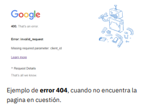

# Fundamentos de Internet

> Redes o tecnología clave que permíte a los ordenadores, envíar y recíbir datos entre sí.

## Internet es la red más grande que hay.

Es global y descentralizada, es decir, no hay un dueño o empresa que pueda manejarla; no hay un aparato que se desenchufey todo elmundo se quede sin internet, es imposible; podrían fallar algunos aparatos y dejar sin internet a cierta zona geográfica (una ciudad o un país a lo sumo), pero nohay una forma para que internet se desconecte totalmente, porque es descentralizado, son redes que se conectan entre ellas alrededor del mundo.

## Hay que tener en cuenta 

Algúnos términos a tener en cuenta, serían :

### Protocolos

Son el conjunto de reglas que las computadoras deben seguir y respetar para poder comunicarse, por ejemplo: si yo hablo español e intentoconversar con alguien que habla chino, no va a poder establecerse una comunicación fluída; de la misma manera, si las computadoras no respetan los mismos protocolos, no podrían comunicarse.

Existen diversos protocolos en función del tipo de comunicación que se establece entre las máquinas:

- **FTP**: Para la transferencia de ficheros.
- **POP y SMTP**: Para el envío y recepción de correo electrónico. 
- **TELNET**: Para la conexión con terminales remotos.
- **GOPHER, WAISy HTTP**: Para el acceso a servidores de información.

> El protocoloHTTP(HyperText Transfer Protocol)es la base de laWorld Wide Webo telaraña mundial, abreviadaWWWy más conocida como Web.

***
### Paquetes

`Los  paquetes  son  los trozos  en  los  que  se  dividen los datos para ser enviados`.Si quisiéramos enviar un gigabyte de datos, no vamos a enviarlo de golpe; los  dispositivos  de  red  lo  dividen  en  paquetes  para poder enviarlo y hacerle seguimiento, es decir, saber si  llegaron  correctamente,  si  hay  que  reintentar  el envío, si llegaron en el orden correcto, etc.NodoUn nodo es una computadora conectada a una red.Tenemos  computadoras  y  tenemos  dispositivos  de red,  que  son  los  que  le  permiten  la  comunicación, entonces, cada computadora conectada a una red se conoce como nodo.PuertosSon las interfaces que permiten la conexión. Hay de dos tipos:•Los puertos físicos.son los puertos donde conectas el cable o la antena que permite conectarse a una red inalámbrica. •Los puertos lógicos.Si nosotros tuviéramos una sola conexión física (por ejemplo: un cable conectado a la computadora) no podríamos navegar por internet y a la vez escuchar una canción por Spotify o visualizar un video por Youtube, porque necesitaríamos dos conexiones. Los puertos lógicos son los que nos permiten a través de una sola conexión física, abrir varias conexiones simultáneamente.

### Nodo

`Un nodo es una computadora conectada a una red`.Tenemos  computadoras  y  tenemos  dispositivos  de red,  que  son  los  que  le  permiten  la  comunicación, entonces, cada computadora conectada a una red se conoce como nodo

### Puertos

`Son las interfaces que permiten la conexión. Hay de dos tipos`:

1. **Los puertos físicos.** son los puertos donde conectas el cable o la antena que permite conectarse a una red inalámbrica.
2. **Los puertos lógicos.**  Los puertos lógicos son los que nos permiten a través de una sola conexión física, abrir varias conexiones simultáneamente.

***

### Latencia

**Es el tiempo que demora en llegar un paquete hasta su destino.** En otras palabras: a `menor latencia mayor velocidad` de conexión.

#### LAN (Local Area Network)

Es una `red de área local`, la más básica que vamos a aprender, es una red en una casa o en una oficina, interconectada en un pequeño espacio geográfico. Normalmente usando una conexión por cable de red.

#### WLAN (Wireless Local Area Network)

Es lo mismo que LAN, pero conectada a través de `redes wifi(redes inalámbricas)`

#### WAN (Wide Area Network)

Si tenemos una `LAN A` y una `LAN B` y queremos conectar las dos, necesitaremos routers. `Los routers nos permiten hacer el enrutamiento entre dos redes locales`. Si sumamos tres, cuatro, cinco, seis o más redes, ya estamos en el `concepto de WAN`.

#### VLAN (Virtual Local Area Network)

Es una `red de área local, pero virtual`, es decir, a través de los dispositivos de red podemos crear redes lógicas o redes virtuales.

## ¿Cómo funcíonan las `redes`?

Hemos hablado de varios de los conceptos que más vamos a analizar cuando estemos desarrollando aplicaciones en Python, al igual que en cualquier otro lenguaje de programación, pero las redes funcionan en dos niveles, un `nivel físico` y un `nivel lógico`.

<section class="acordeonplus">

        

            
Nivel Físico

            
Vamos a ver tres conceptos básicos : 
            <ul>
            <li><strong>Hosts:</strong> Son  todos  los  dispositivos  con  los que   el   usuario   interactúa,   por   ejemplo: computadoras, impresoras, teléfonos, servidores, etc</li>
            <li><strong>Dispositivos de red:</strong> Son los que permiten la conexión, porejemplo: switches, routers, accesspoint, antenas, etc.</li>
            <li><strong>Adaptadores de red:</strong> :Son dispositivos que están  dentro  de  los  hosts  y  permiten  que ellos se conecten a la red. Un adaptador de red    traduce    la    señal    eléctrica    si    es cableado, o inalámbrica si nos conectamos a un wifi y la traduce a un tipo de señal que la computadora puede procesar.</li>
            <li><strong>IOT: </strong> Internet  of  things  (el  internet  de  las cosas).  Vivimos  en  una  época  en  la  cual disponemos de una infinida de dispositivos y electrodomésticos que pueden conectarse  a  internet,  eso  se  llama IoTo internetde   las   cosas,   cada   dispositivo tendría   un   adaptador   que   le   permitiría conectarse con el mundo.</li>
            </ul>
            

        

        

        

        

            
Nivel Lógico

            
Por   este   lado   tenemos   el   tema   de   los protocolos y del software. 
            <ul>
            <li><strong>Protocolos:</strong> Como dijimos anteriormente, son el conjunto de reglas que tienen que seguir los dispositivos para conectarse a la red</li>
            <li><strong>Software:</strong> Es  aquel  que  ya  viene  ya  viene integrado  en  los  mismos  dispositivos  de  red, por  ejemplo:  un  router  viene  con  su  propio sistema   operativo   y   se   puede   configurar según las necesidades.</li>
            </ul>
            

        

        

</section>

***

## Funcionamíento de la web

La  Web  funciona  siguiendo  el  denominado  modelo cliente-servidor,  habitual  en  las  aplicaciones  que funcionan en una red.
Existe un servidor, que es quien presta el servicio, y un cliente, que es quien lo recibe.

### Cliente web

El cliente web es un programa con el que el usuario
interacciona para solicitar a un servidor web el envío
de páginas de información.

Estas páginas se transfieren mediante el protocolo
HTTP.  
La mayoría de ellos soportan también otros
protocolos, como, por ejemplo:

- **FTP** (File TransferProtocol)
para la transferencia de ficheros.
- **SMTP** (Single Mali Transfer Protocol)
para el envío y la recepcíon de correo electrónico.

### Servidor web

El servidor web es un programa que está
permanentemente escuchando las peticiones de
conexión de los clientes mediante el protocolo HTTP.  
El servidor funciona de la siguiente manera: si
encuentra en su sistema de ficheros el documento
HTML solicitado por el cliente, lo envía y cierra la
conexión; en caso contrario, envía un código de
error que cierra la conexión.

"El servidor web también se ocupa de controlar los
aspectos de seguridad, comprobando si el usuario
tiene acceso a los documentos."

### Las direcciones IP

Cualquier dispositivo que se conecte a internet
necesita una dirección IP. Estas direcciones son
series únicas de números que permiten a un
dispositivo enviar y recibir información.

#### Las IPs pueden ser de dos tipos:

1. **Fijas o estáticas**  
  direcciones IP que nunca
cambian.
2. **Dinámicas**  
  aquellas que por el motivo que fuera
cambian cada cierto tiempo.

Podríamos decir que las IPs son como una dirección
postal, un lugar único desde el que pueden enviarse
y en el que se pueden recibir, por ejemplo, cartas. No
hay dos direcciones postales iguales, por lo tanto, se
garantiza al máximo que, en este caso, los datos
viajen siempre entre los dos puntos correctos.

### **El protocolo TCP**

Cuando se comenzó a diseñar internet, ya se tuvo en
cuenta que para que la red funcionara debía estar
compuesta por una serie de capas y protocolos. De
esta forma sería posible delimitar las funciones de
cada nivel para que las capas siguientes no tengan
que participar en determinados procesos o errores.

#### Inspirado en el modelo __OSI__ , más orientado al ámbito
académico, 

##### internet recurre al __TCP/IP__ para dividir la
arquitectura en cuatro capas: __acceso__ a __red__, __interred__,
__transporte__ y __aplicación__.

En estas capas se indican
cómo se produce el acceso a la red, la entrega de
paquetes garantizando su llegada a destino y el
orden en el que deben gestionarse. Para ello, se
recurre al protocolo IP, el encargado de estructurar
los paquetes de datos y algo así como «quien
mantiene unido internet»
***
`Para entender` cómo funciona internet es necesario
saber que, en sus primeras capas, el protocolo __IP__
tiene el mapa de los paquetes de datos. Conoce el
camino que deben seguir todos los paquetes y se lo
comunica a __TCP__, quien se ocupa de que las
máquinas que deben enviar y recibir esos paquetes
se pongan en comunicación. `También es posible`
enviar paquetes a través de __UDP__ `(User Datagram
Protocol)`, un protocolo que no requiere de una
conexión previa entre la máquina emisora y la
receptora. La última capa, a nivel de aplicación,
contiene todos los protocolos necesarios para el
intercambio de datos. Principalmente destacan __DNS__
y __HTTP__, aunque esta capa contiene otros muchos
como __FTP__ que están en desuso.

### **Los datos viajeros**

- El funcionamiento de internet se basa en paquetes
de datos que viajan constantemente de un lado a
otro. Para que el proceso pueda realizarse de forma
correcta es necesario, entre otras cosas, que se haga
de forma equilibrada. Es decir, que los
intermediarios puedan conocer las rutas más
adecuadas para evitar la saturación de la red. Así, es
posible que dos paquetes que tengan la misma ruta
vayan por caminos diferentes para garantizar el
balanceo del tráfico.
- De saturarse la red algunos paquetes de datos se
perderán y no podrán establecerse determinadas
conexiones; es decir, no podrá accederse a unos
recursos concretos de internet. El tráfico en internet
funciona como una carretera o una empresa de
paquetería, sin una buena gestión únicamente
llevará al colapso de la red, de la carretera o de las
líneas de distribución.

### **Servidores DNS**

- Los servidores DNS se ocupan de traducir los
nombres de dominio a direcciones IP.
- Puesto que la dirección IP es
fundamental para acceder a los recursos de internet
necesitamos de una base de datos que convierta en
IP los dominios o las direcciones de correo que
utilizamos.
- El proceso de traducción es en la práctica un poquito
más complejo. Las aplicaciones deberán llamar al
“resolvedor” para que se encargue de gestionar la
cadena ASCII a traducir.
- Este enviará un paquete
UDP a un servidor DNS para que localice el nombre
del dominio y le devuelva la IP en la que se
encuentra.
- Con esta información podrá establecerse
la conexión TCP necesaria para enviar los paquetes
de datos.