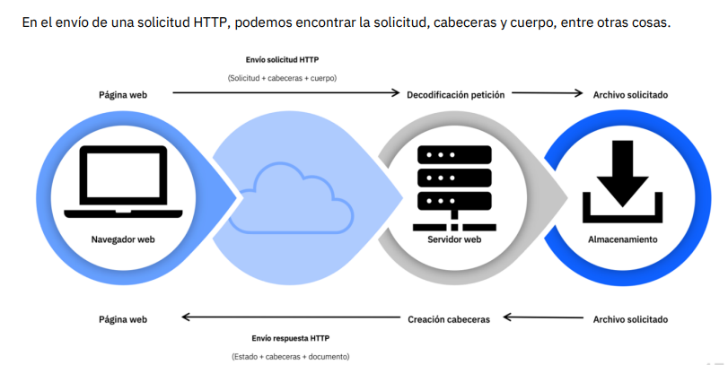
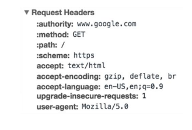

# **HTTP Introducción**

<style>

        h2 {
            color: yellowgreen;
            text-shadow: 0.1vh 0.1vw 1px aliceblue, 0vh 0vw 5px crimson, -0.1vh -0.1vw 1px aliceblue;
            font-family: 'monospace';
        }

        h3 {
            color: greenyellow;
            text-decoration: blue underline 0.2vw dashed;
            line-height: 1.5vw;
        }

        h4 {
            padding: 0.5vh 1vw;
            width: fit-content;
            color: blanchedalmond;
            box-shadow: inset 0 0 7px 3px aliceblue;
        }


</style>

## __http__ o  uno de los puntos básicos de Internet.

Según sus siglas en inglés, **`HyperText Transfer
Protocol`** __(Protocolo de transferencia de hipertexto)__ es
el método más común de intercambio de información
de la **World Wide Web**.

- Es un protocolo que define
cómo se deben formatear y transmitir los datos a
través de Internet. 
-  Se utiliza para cargar páginas web
con enlaces de hipertexto.
- Este protocolo de
transferencia de hipertexto fue diseñado por Tim
Berners-Lee en 1989.

## ¿Qué hay en una solicitud **HTTP**?

Una solicitud HTTP es la forma en que las plataformas de
comunicación de Internet, como los navegadores web,
piden la información que necesitan para cargar un sitio web.

### **Una solicitud HTTP típica contiene:**

- Tipo de versión de __HTTP__
- Una **URL**
- Un método __HTTP__
- Encabezados de solicitud __HTTP__
- Cuerpo __HTTP__ opcional


***
#### ¿Qué es un método HTTP?

`Un método` __HTTP__, a veces denominado `verbo HTTP`,
indica la acción que la solicitud __HTTP__ espera del
servidor consultado.

### 1. **GET**
   - **Descripción**: Este método se usa para solicitar datos de un servidor. No modifica nada, solo recupera información.
   - **Ejemplo**: Un cliente pide la lista de productos.
   - **Código básico**:
     ```http
     GET /productos HTTP/1.1
     Host: www.ejemplo.com
     ```

### 2. **POST**
   - **Descripción**: Se utiliza para enviar datos al servidor, generalmente para crear o modificar recursos. Los datos suelen enviarse en el cuerpo de la solicitud.
   - **Ejemplo**: Enviar datos de un nuevo usuario para que se cree en la base de datos.
   - **Código básico**:
     ```http
     POST /usuarios HTTP/1.1
     Host: www.ejemplo.com
     Content-Type: application/json

     {
       "nombre": "Juan",
       "email": "juan@ejemplo.com"
     }
     ```

### 3. **PUT**
   - **Descripción**: Sirve para reemplazar o actualizar completamente un recurso en el servidor. Es idempotente, lo que significa que la misma solicitud repetida no cambia el resultado.
   - **Ejemplo**: Actualizar la información de un usuario.
   - **Código básico**:
     ```http
     PUT /usuarios/123 HTTP/1.1
     Host: www.ejemplo.com
     Content-Type: application/json

     {
       "nombre": "Juan Actualizado",
       "email": "juan_actualizado@ejemplo.com"
     }
     ```

### 4. **PATCH**
   - **Descripción**: Similar a `PUT`, pero en lugar de reemplazar completamente un recurso, modifica solo partes específicas del mismo.
   - **Ejemplo**: Actualizar solo el email de un usuario.
   - **Código básico**:
     ```http
     PATCH /usuarios/123 HTTP/1.1
     Host: www.ejemplo.com
     Content-Type: application/json

     {
       "email": "nuevo_email@ejemplo.com"
     }
     ```

### 5. **DELETE**
   - **Descripción**: Elimina un recurso del servidor.
   - **Ejemplo**: Borrar un usuario de la base de datos.
   - **Código básico**:
     ```http
     DELETE /usuarios/123 HTTP/1.1
     Host: www.ejemplo.com
     ```

### 6. **HEAD**
   - **Descripción**: Es igual que `GET`, pero solo solicita los encabezados, sin el cuerpo del contenido. Se usa para obtener metadatos como el tamaño o la fecha de modificación.
   - **Ejemplo**: Verificar si un recurso ha cambiado antes de descargarlo.
   - **Código básico**:
     ```http
     HEAD /productos HTTP/1.1
     Host: www.ejemplo.com
     ```

### 7. **OPTIONS**
   - **Descripción**: Solicita información sobre las opciones de comunicación disponibles para el recurso. Devuelve los métodos permitidos para ese recurso.
   - **Ejemplo**: Saber qué métodos son válidos para un recurso.
   - **Código básico**:
     ```http
     OPTIONS /usuarios HTTP/1.1
     Host: www.ejemplo.com
     ```

### 8. **CONNECT**
   - **Descripción**: Establece un túnel hacia el servidor, generalmente se usa para solicitudes HTTPS a través de un proxy.
   - **Ejemplo**: Crear una conexión segura (SSL/TLS) con un servidor.
   - **Código básico**:
     ```http
     CONNECT www.ejemplo.com:443 HTTP/1.1
     Host: www.ejemplo.com
     ```

### 9. **TRACE**
   - **Descripción**: Realiza un bucle de retorno que permite al cliente ver qué cambios (si los hay) están siendo hechos a su solicitud por intermediarios (proxies, por ejemplo).
   - **Ejemplo**: Ver cómo se modifica una solicitud a través de una cadena de proxies.
   - **Código básico**:
     ```http
     TRACE /usuarios/123 HTTP/1.1
     Host: www.ejemplo.com
     ```

### 10. **LINK** *(Poco común)*
   - **Descripción**: Establece una relación entre dos recursos. No es muy utilizado y no está implementado en la mayoría de los servidores.
   - **Ejemplo**: Relacionar un documento con otro.
   - **Código básico**:
     ```http
     LINK /documentos/1 HTTP/1.1
     Host: www.ejemplo.com
     Link: </documentos/2>; rel="related"
     ```

### 11. **UNLINK** *(Poco común)*
   - **Descripción**: Elimina una relación entre dos recursos previamente establecida con el método `LINK`.
   - **Ejemplo**: Desvincular dos documentos.
   - **Código básico**:
     ```http
     UNLINK /documentos/1 HTTP/1.1
     Host: www.ejemplo.com
     Link: </documentos/2>; rel="related"
     ```

---

Estos son los métodos HTTP más importantes, aunque algunos son poco usados en la práctica o han sido propuestos en versiones más recientes del protocolo. Los más comunes en aplicaciones diarias son `GET`, `POST`, `PUT`, `PATCH`, `DELETE`, `HEAD` y `OPTIONS`.

#### ¿Qué son los encabezados de solicitud __HTTP__?

##### `Los encabezados de HTTP contienen información de texto almacenada en pares clave-valor, y se incluyen en cada solicitud HTTP`

Estos encabezados comunican información básica,
como el navegador que utiliza el cliente y los datos
que se solicitan.



#### ¿Qué hay en el cuerpo de una solicitud __HTTP__?

El cuerpo de una solicitud HTTP contiene
toda la información que se envía al servidor web,
como un nombre de usuario y una contraseña, o
cualquier otro dato introducido en un formulario.

#### ¿Qué hay en una respuesta __HTTP__?

Una respuesta __HTTP__ es lo que los clientes web
(normalmente los navegadores) reciben de un
servidor de Internet en respuesta a una solicitud
__HTTP__.

##### Una respuesta HTTP típica contiene:

1. [un código de estado HTTP](#qué-es-un-código-de-estado-http)

2. `encabezados de respuesta` __HTTP__
3. cuerpo de __HTTP__ opcional


## ¿Qué es un código de estado HTTP?

<!-- Los códigos de estado HTTP  -->
Son códigos de 3 dígitos que se utilizan con mayor frecuencia para indicar si una solicitud HTTP se ha completado con éxito.
<!-- 
##### Los códigos de estado se dividen en los siguientes 5 bloques: -->

<!-- 1. 1xx Informativo
2. 2xx Éxito
3. 3xx Redirección
4. Errores de cliente 4xx
5. 5xx Error del servidor

> Las "xx" hace referencia a diferentes números entre 00 y 99. -->

***

 Los **códigos de estado HTTP** son respuestas estándar proporcionadas por los servidores web al cliente (por ejemplo, tu navegador) para indicar el resultado de una solicitud. Cada código consta de tres dígitos, donde el primer dígito indica la categoría del estado, y los dos dígitos siguientes especifican detalles más precisos.

### Categorías de códigos de estado HTTP:

1. **1xx - Informativo**: Son respuestas provisionales que indican que el servidor recibió la solicitud y está siendo procesada.
   - Ejemplo: `100 Continue` (el servidor recibió la solicitud y está esperando los datos completos del cliente).

2. **2xx - Éxito**: Indican que la solicitud fue recibida, entendida y aceptada correctamente.
   - Ejemplo: `200 OK` (la solicitud se procesó con éxito).

3. **3xx - Redirección**: Significan que es necesario realizar más acciones para completar la solicitud, generalmente una redirección a otra URL.
   - Ejemplo: `301 Moved Permanently` (el recurso solicitado ha sido movido de forma permanente a una nueva URL).

4. **4xx - Error del cliente**: Indican que el problema está en el lado del cliente, como una solicitud malformada o un recurso no encontrado.
   - Ejemplo: `404 Not Found` (el servidor no pudo encontrar el recurso solicitado).

5. **5xx - Error del servidor**: Indican que hubo un fallo en el servidor mientras intentaba procesar la solicitud.
   - Ejemplo: `500 Internal Server Error` (ocurrió un error inesperado en el servidor).

### Ejemplo sencillo con una interacción cliente-servidor:

Imaginemos que estás visitando una página web (como `www.example.com`):

1. **Solicitud del cliente**: 
   Tu navegador envía una solicitud al servidor para obtener la página.

   ```http
   GET /index.html HTTP/1.1
   Host: www.example.com
   ```

2. **Respuesta del servidor**:

   - Si todo sale bien, el servidor responde con:
     ```http
     HTTP/1.1 200 OK
     Content-Type: text/html
     
     <html>
       <body>
         <h1>Bienvenido a Example.com</h1>
       </body>
     </html>
     ```
     El código `200 OK` indica que la solicitud fue exitosa, y se te devuelve la página web.

   - Si la página no existe, el servidor responde con:
     ```http
     HTTP/1.1 404 Not Found
     Content-Type: text/html
     
     <html>
       <body>
         <h1>Página no encontrada</h1>
       </body>
     </html>
     ```
     Aquí el código `404 Not Found` te dice que el recurso solicitado (por ejemplo, `/index.html`) no existe en el servidor.

   - Si el servidor tiene un problema interno, como una falla en su base de datos, podría responder con:
     ```http
     HTTP/1.1 500 Internal Server Error
     Content-Type: text/html
     
     <html>
       <body>
         <h1>Error interno del servidor</h1>
       </body>
     </html>
     ```
     Este código `500 Internal Server Error` indica que el servidor no pudo completar la solicitud debido a un error en su sistema.

### Resumen:
- **1xx**: Informativo (el servidor está procesando la solicitud).
- **2xx**: Éxito (la solicitud fue exitosa).
- **3xx**: Redirección (el recurso fue movido o requiere otra acción).
- **4xx**: Error del cliente (hubo un problema con la solicitud).
- **5xx**: Error del servidor (algo falló en el lado del servidor).

Estos códigos ayudan tanto a los usuarios como a los desarrolladores a entender lo que está pasando con sus solicitudes HTTP.
